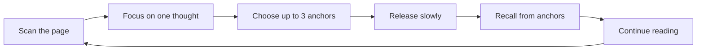
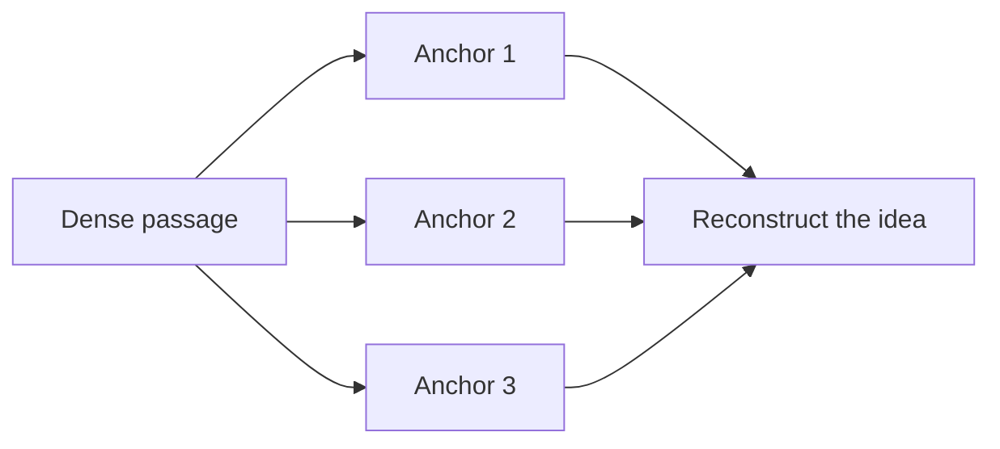
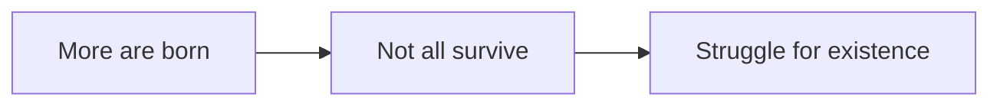
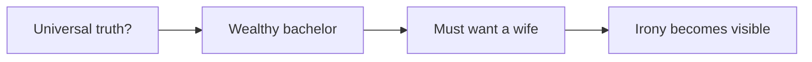
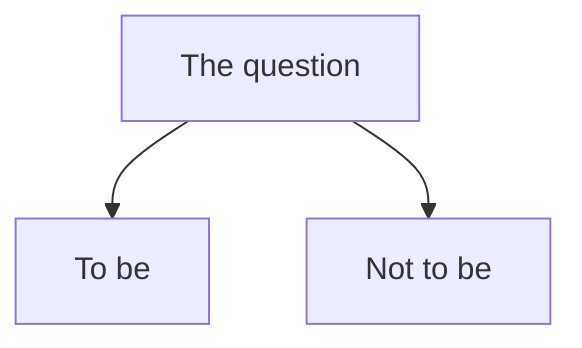
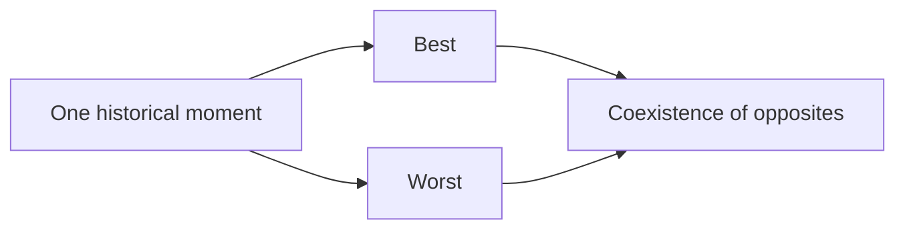
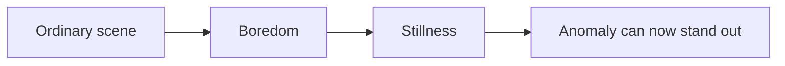
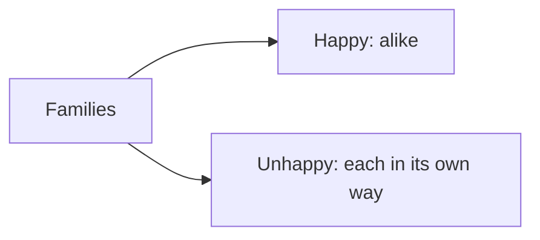

# Viewoupe Focus Reading Method

> **Scan → Focus → Anchor → Release → Recall**
>
> Viewoupe is not only a magnifier. It is a way to turn continuous reading into short, deliberate focus cycles.

## 1. The method

### Scan
Read the page at normal scale. Do not try to absorb every line. Find the paragraph, sentence, or passage that deserves closer attention.

### Focus
Open Viewoupe on one meaningful unit. The surrounding page dims so the current thought becomes the dominant visual object.

### Anchor
Select up to three short phrases that carry the structure of the passage. An anchor is not a highlight of everything important; it is a retrieval cue.

Good anchor:

- `struggle for existence`

Weak anchor:

- an entire paragraph copied into a highlight

### Release
Close the focused layer. The page should return gradually rather than snapping back immediately. The short visual afterglow gives the reader time to consolidate the thought just read.

### Recall
Before continuing, reconstruct the passage from the anchors. If the three cues are sufficient to recover the argument, the anchors are doing their job.

## 2. Why three anchors

Three anchors are deliberately restrictive. They force the reader to distinguish the semantic skeleton from supporting detail.

The target is not perfect transcription. The target is recoverability: can the reader reconstruct the thought from a small number of cues?

---

# Classic Reading Corpus

The examples below use original-language works first published in the nineteenth century or earlier. The demo corpus intentionally avoids modern translations, modern editions, introductions, annotations, and illustrations that may carry separate rights.

The excerpts are intentionally short. A production demo may use longer public-domain source passages after checking the specific edition and jurisdiction in which the site is published.

## 3. Charles Darwin — *On the Origin of Species* (1859)

### Passage

> “As many more individuals of each species are born than can possibly survive…”

### What the reader is trying to understand

Darwin is building a causal argument rather than merely describing nature. Viewoupe should make the causal sequence visible.

### Focus cycle

1. **Scan:** locate the sentence where Darwin moves from reproduction to survival pressure.
2. **Focus:** isolate that sentence and the immediately following reasoning.
3. **Anchor:** choose the causal skeleton.

Suggested anchors:

- `more are born`
- `cannot all survive`
- `struggle for existence`

### Recall

From those anchors the reader should be able to reconstruct:

**Excess reproduction → limited survival → competition / struggle.**

### Illustration

### What this demonstrates

**Argument extraction.** A long nineteenth-century paragraph becomes a short causal chain.

---

## 4. Jane Austen — *Pride and Prejudice* (1813)

### Passage

> “It is a truth universally acknowledged, that a single man in possession of a good fortune, must be in want of a wife.”

### What the reader is trying to understand

The literal proposition is less important than the social irony built into its certainty.

Suggested anchors:

- `universally acknowledged`
- `good fortune`
- `must be in want of a wife`

### Recall

The three anchors expose the structure:

**claimed universal truth → wealthy bachelor → compulsory marriage expectation.**

The reader can then ask: is this really a universal truth, or is Austen presenting the assumptions of the society she is about to examine?

### Illustration

### What this demonstrates

**Reading for subtext.** Anchors can reveal rhetorical distance, not only factual content.

---

## 5. William Shakespeare — *Hamlet* (c. 1600)

### Passage

> “To be, or not to be: that is the question.”

### What the reader is trying to understand

The sentence is a decision structure compressed into a famous phrase.

Suggested anchors:

- `to be`
- `not to be`
- `the question`

### Recall

**Continue existence ↔ cease existence → a question requiring examination.**

When the reader continues into the monologue, later anchors can be added around endurance and resistance.

### Illustration

### What this demonstrates

**Reading a conceptual fork.** Viewoupe can expose the decision geometry inside literary language.

---

## 6. Charles Dickens — *A Tale of Two Cities* (1859)

### Passage

> “It was the best of times, it was the worst of times…”

### What the reader is trying to understand

Dickens establishes his world through paired opposites. The structure matters as much as the individual words.

Suggested anchors:

- `best`
- `worst`
- `same time`

### Recall

**Contradictory conditions coexist.** The opening teaches the reader how to interpret the historical world that follows.

### Illustration

### What this demonstrates

**Structural contrast.** Anchors show parallel construction immediately.

---

## 7. Lewis Carroll — *Alice’s Adventures in Wonderland* (1865)

### Passage

> “Alice was beginning to get very tired of sitting by her sister on the bank…”

### What the reader is trying to understand

The story begins in an ordinary, low-stimulation state so that the coming disruption can feel stronger.

Suggested anchors:

- `very tired`
- `sitting`
- `on the bank`

### Recall

**Boredom → stillness → ordinary setting.**

That becomes the baseline against which the White Rabbit will register as an anomaly.

### Illustration

### What this demonstrates

**Narrative baseline.** Viewoupe can help readers notice why a scene is written a certain way, not merely what happens in it.

---

# Russian-language corpus

These examples use the Russian originals rather than modern translations.

## 8. Александр Пушкин — *Евгений Онегин* (1825–1832)

### Passage

> «Мой дядя самых честных правил, когда не в шутку занемог…»

Suggested anchors:

- `честных правил`
- `занемог`
- `дядя`

### Reading goal

Separate the surface statement from the narrator’s tone and the social obligation implicit in what follows.

### Semantic map

**respectable formula → illness → obligation / irony.**

---

## 9. Николай Гоголь — *Мёртвые души* (1842)

### Passage

> «В ворота гостиницы губернского города NN въехала довольно красивая рессорная небольшая бричка…»

Suggested anchors:

- `губернского города NN`
- `въехала`
- `бричка`

### Reading goal

Notice how Gogol introduces the story through an apparently ordinary arrival while withholding precise identity and location.

### Semantic map

**anonymous place → arrival → unknown traveller.**

---

## 10. Фёдор Достоевский — *Преступление и наказание* (1866)

### Passage

> «В начале июля, в чрезвычайно жаркое время, под вечер…»

Suggested anchors:

- `начале июля`
- `чрезвычайно жаркое`
- `под вечер`

### Reading goal

Extract the physical conditions before following the character: season, heat, and time of day establish pressure before the plot advances.

### Semantic map

**summer → oppressive heat → evening → psychological atmosphere.**

---

## 11. Лев Толстой — *Анна Каренина* (1878)

### Passage

> «Все счастливые семьи похожи друг на друга, каждая несчастливая семья несчастлива по-своему.»

Suggested anchors:

- `счастливые семьи`
- `похожи`
- `несчастлива по-своему`

### Reading goal

Read the sentence as a thesis built from asymmetry rather than as a decorative aphorism.

### Semantic map

### What this demonstrates

**Thesis extraction.** A memorable sentence becomes an explicit conceptual model.

---

# 12. Recommended teaching sequence

The examples can be used as a progression rather than a gallery of quotations:

1. **Carroll** — identify the baseline of a scene.
2. **Dickens** — see structural contrast.
3. **Austen** — detect irony and social assumptions.
4. **Darwin** — reconstruct a causal argument.
5. **Shakespeare** — map a conceptual fork.
6. **Tolstoy / Pushkin / Gogol / Dostoevsky** — repeat the same method in Russian originals.

The progression moves from **what is happening** toward **how the thought is constructed**.

# 13. Product principle

The methodology should remain subordinate to reading. Viewoupe must not turn every paragraph into an exercise.

A useful default rhythm is:

**Scan freely → Focus only when needed → Anchor only when worth remembering → Recall after several focused passages.**

The goal is not to make the reader interact more. The goal is to make difficult passages cost less attention.